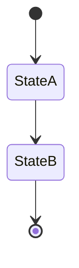
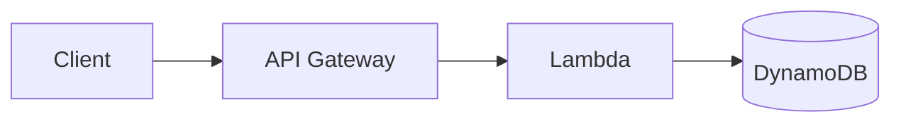

# AWS Serverless Architecture Design

> Derived from: `<path to source tech spec / PRD>`
> Status: draft / in review / final

## 1. Overview & Constraints

- **Source document:** `<link>`
- **Scope:** `<what this design pass covers>`
- **AWS-only, serverless-only:** no EC2, ECS/EKS, self-managed servers, or non-AWS services.
- **Assumptions carried over from source document:** `<list, or "none">`

---

## 2. Compute — AWS Lambda

| Function | Trigger | Responsibility | Source (FR-n / flow) | Notes |
|---|---|---|---|---|
| `<FunctionName>` | `<API GW route / SQS / EventBridge / Step Functions task>` | `<one line>` | `<FR-n or flow name>` | `<timeout, memory, concurrency notes if relevant>` |

---

## 3. Data Layer — DynamoDB

### Table: `<TableName>`

- **Source entity (from spec):** `<Data Entities row name>`
- **Partition key:** `<PK>`
- **Sort key:** `<SK or "none">`
- **Capacity mode:** on-demand / provisioned
- **TTL attribute:** `<attribute or "none", from source Retention column>`

**Access patterns satisfied:**

| # | Access pattern | Key/Index used | Source (FR-n) |
|---|---|---|---|
| 1 | `<e.g. get cart by user email>` | Base table (PK=`<...>`) | `<FR-n>` |

**Global Secondary Indexes:**

| GSI name | PK | SK | Purpose | Source (FR-n) |
|---|---|---|---|---|

---

## 4. API Layer — API Gateway

| Route | Method | Auth | Backing Lambda | Source (FR-n / actor) | Notes |
|---|---|---|---|---|---|
| `<path>` | `<GET/POST/...>` | `<Cognito/IAM/API key/none>` | `<FunctionName>` | `<FR-n>` | |

---

## 5. Orchestration — Step Functions

### Workflow: `<StateMachineName>`

- **Type:** Standard / Express
- **Trigger:** `<API GW / EventBridge / SQS>`
- **Source flow (from spec):** `<Workflow/User Flow name>`

| State | Type | On success | On failure/retry | Enforces business rule / FR-n |
|---|---|---|---|---|

---

## 6. Messaging — SQS / SNS / EventBridge

| Resource | Type | Producers | Consumers | DLQ | Source (FR-n / flow) |
|---|---|---|---|---|---|
| `<QueueOrTopicName>` | SQS/SNS/EventBridge | `<...>` | `<...>` | `<yes/no + target>` | `<FR-n>` |

---

## 7. IAM — Least-Privilege Intent

| Component | Can access | Access level | Source (actor / FR-n) | Notes |
|---|---|---|---|---|
| `<FunctionName>` | `<resource>` | `<read/write/invoke>` | `<actor or FR-n>` | |

---

## 8. Business Rule Enforcement

| Business rule (from spec) | Enforcement mechanism | Where |
|---|---|---|
| `<Rule name>` | `<Lambda validation / DynamoDB conditional write or transaction / Step Functions Choice state>` | `<FunctionName / TableName / StateMachineName>` |

---

## 9. Observability (non-blocking)

- CloudWatch Logs: `<default per Lambda>`
- Alarms: `<list or "none defined yet">`

---

## 10. Architecture Diagram

---

## 11. Open Questions

- `<anything left unresolved when the user stopped the loop>`
