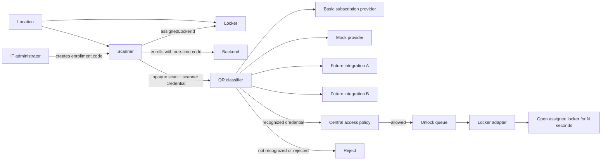

# Access Control Architecture

## Status

Approved Phase 0 architecture. Phase 1 introduces data structures only; it does not change access behavior.

## Goals

- Support multiple QR credential providers without coupling them to hardware or subscription checks.
- Support unknown scanner and locker hardware through replaceable adapters.
- Let IT administrators enroll scanners and lockers from the administrator panel.
- Ensure physical location and lock selection are derived from trusted server-side scanner registration.
- Preserve the existing asynchronous SQS lock-command boundary.

## Resource Model

Each scanner and locker belongs to exactly one location. In the first release, an active scanner has exactly one assigned locker. A locker may be reassigned only by an IT administrator and must remain in the same location as its scanner.

## Trusted Context

The scan client sends only its credential and opaque scan content. It must not supply, or control, the location, selected locker, allowed provider list, unlock duration, reader adapter, or locker adapter.

The backend authenticates the scanner credential and derives trusted metadata from the registered scanner and locker records:

- location and access policy;
- permitted QR providers;
- assigned locker and configured unlock duration;
- scanner reader adapter and locker adapter;
- device status and hardware configuration.

The QR credential never selects a locker. A recognized credential may contain location or entitlement claims, but central access policy decides whether it may enter at the authenticated scanner's location.

## QR Classification

The classifier receives a normalized scan envelope. Providers interpret credentials only; they do not open locks or perform the central subscription/anti-passback decision.

Each provider produces one of three outcomes:

- `not-recognized`: the provider does not own this credential format; another permitted provider may be tried.
- `rejected`: the provider recognizes the format but the credential is invalid, expired, or unavailable; classification stops and access is denied.
- `recognized`: the provider returns a normalized credential; central access policy continues.

The initial provider slots are `basic-subscription`, `mock`, and two reserved external integrations. New providers are added by implementing the QR provider contract and registering the provider identifier; no scanner or locker logic changes.

## Enrollment and Credential Lifecycle

1. An IT administrator selects a location and creates a pending scanner.
2. The backend creates a short-lived, single-use enrollment code and displays it as text and QR in the administrator panel.
3. The physical scanner uses the enrollment code to call the enrollment endpoint.
4. The backend binds the scanner hardware to the pending scanner record and returns a permanent scanner credential once.
5. The IT administrator adds or configures a locker and assigns it to the scanner.
6. The scanner is active only when it has an active credential and an assigned active locker.

Enrollment codes are stored only as hashes and expire. Scanner credentials are stored only as hashes; the original secret is displayed once during provisioning and may later be rotated or revoked.

## Responsibilities

| Component | Responsibility | Must not do |
| --- | --- | --- |
| Reader adapter | Convert hardware-specific input to a normalized scan envelope. | Select a locker or decide access. |
| QR provider | Recognize and interpret a credential. | Open hardware or own central subscription policy. |
| Central access policy | Validate provider claims against subscription, location policy, and anti-passback rules. | Depend on physical hardware protocols. |
| Locker adapter | Open the server-selected locker for its configured duration. | Trust QR-provided hardware targets. |
| Administrator panel | Provision and monitor scanner/locker registrations. | Display persistent scanner secrets. |

## Initial Adapter Defaults

- Reader adapter: `mock`
- QR providers: `basic-subscription`, `mock`
- Locker adapter: `mock`
- Default unlock duration: 5 seconds

Future hardware integrations select adapters through registered server-side identifiers. Adapter-specific configuration is isolated in each scanner or locker record rather than exposed to QR providers.

## Audit and Reliability Requirements

- Persist a hash of raw scan content, never raw QR content by default.
- Entry audit data identifies the scanner, location, QR provider, access result, and command correlation ID.
- Unlock requests remain asynchronous through SQS.
- Retryable locker failures must be surfaced to SQS for retry; non-retryable configuration errors must be explicitly logged.
- An unavailable provider that recognizes a credential format fails closed and does not fall through to another provider.

## Access Commitment and Unlock Outbox

Access eligibility evaluation is read-only. It returns either a denial or an `AccessAuthorization`; it must not write an entry log, consume anti-passback state, or emit a hardware command.

Before committing access, the backend resolves the scanner's assigned active locker. It then creates the anti-passback entry record and a pending `UnlockOutboxItem` in one DynamoDB transaction. This transaction is the point at which access becomes committed. A later outbox dispatcher delivers the immutable `UnlockCommand` to SQS and records dispatch lifecycle state through `OutboxStatusIndex`.

If scanner, locker, policy evaluation, or transaction setup fails, no anti-passback state changes. If asynchronous command delivery fails after commitment, the outbox remains retryable until the command is delivered or enters an explicitly recorded terminal failure state.

## Phase 3 Structural Index

| ID | Source location | TODO boundary |
| --- | --- | --- |
| ACCESS-001 | `lib/handlers/verify-entry/index.ts:25` | Resolve an active registered scanner from the request credential and derive trusted location, providers, and locker. |
| ACCESS-002 | `lib/handlers/verify-entry/index.ts:38` | Normalize opaque scanner data and classify it through the scanner's permitted QR providers. |
| ACCESS-003 | `lib/handlers/verify-entry/index.ts:71` | Resolve the assigned locker, then perform read-only entitlement, location, and anti-passback evaluation. |
| ACCESS-004 | `lib/handlers/verify-entry/index.ts:107` | Atomically commit entry attribution, anti-passback state, and a pending unlock outbox item. |
| ACCESS-005 | `lib/handlers/execute-unlock/index.ts:8` | Consume an immutable command emitted by the durable outbox and invoke the resolved locker adapter. |
| ACCESS-006 | `lib/handlers/shared/providers/lock.ts:3` | Compose mock and future hardware locker adapters from a locker-owned adapter identifier. |
| ACCESS-007 | `lib/handlers/admin/index.ts:123` | Replace generic device listing with location-scoped scanner and locker administration data. |
| ACCESS-008 | `lib/handlers/admin/index.ts:154` | Add IT-admin provisioning routes for enrollment, credentials, lockers, and assignments. |
| ACCESS-009 | `frontend/admin/src/components/LocationManagerCard.tsx:28` | Add the location-scoped scanner/locker management UI, including enrollment-code display and assignment. |
| ACCESS-010 | `frontend/admin/src/store/adminSlice.ts:40` | Add administrator-panel state and API calls for scanner and locker provisioning operations. |
| ACCESS-011 | `lib/stacks/data-stack.ts:70` | Add `OutboxStatusIndex` for efficient durable-command claim and retry. |
| ACCESS-012 | `lib/stacks/api-stack.ts:213` | Add an outbox-dispatch Lambda with outbox persistence and SQS publication permissions. |

Phase 4 may implement only these boundaries. Changing their responsibilities requires a return to Phase 3 approval.

## Phase 6 Implementation

The production implementation is complete. Registered scanners and lockers are stored in the existing location partition of `MainTable` and use the existing API-key index for scanner authentication. The administrator panel can create mock scanners and lockers and assign a locker to a scanner within the selected location.

Registered scans resolve their assigned active locker before QR classification. Basic-subscription and mock QR providers are live; `integration-a` and `integration-b` remain registered stubs. After subscription validation, the handler atomically writes anti-passback state, an entry log, and a pending immutable unlock outbox item. A scheduled dispatcher publishes pending commands to SQS and records dispatch or retryable failure. The existing unlock consumer resolves the locker again and selects its mock or HTTP adapter. Legacy device verification and unlock messages remain supported for migration compatibility.

## Phase 4 Simulation Record

The revised simulation used in-memory mock scanner, QR-provider, policy, registry, outbox, and locker adapters. Temporary simulation source and tests were removed with the Phase 4 revert helper after test output was captured.

| Scenario | Result | Boundary confirmed |
| --- | --- | --- |
| Two scanners at different locations | Passed | Each committed and dispatched only its own assigned locker command. |
| Same locker ID at another location | Passed | Location-scoped locker lookup prevented a cross-location command and outbox entry. |
| Locker unavailable then recovered | Passed | No anti-passback state existed before locker resolution and atomic commitment. |
| Temporary locker-adapter failure | Passed | The committed outbox command stayed retryable and dispatched on a later attempt. |
| Recognized unavailable provider | Passed | Classification failed closed and created no outbox command. |
| Signed basic subscription QR | Passed | Valid credentials created a pending outbox command before hardware dispatch. |

## Phase 4.5 Defect Pattern Validation

- **Whack-A-Mole coupling:** Tested. Scanner/location state stayed isolated through commitment and dispatch.
- **English-to-Code translation:** Tested. The schema and location-scoped lookup rejected same-ID lockers outside the authenticated scanner's location.
- **Speculative simulation timing:** Tested. The original pre-locker anti-passback defect was fixed by read-only evaluation followed by atomic commitment.
- **Agent slop:** Tested. Providers did not select lockers or emit commands; unavailable recognized providers failed closed.

## Phase 5 Invariants

| Invariant | Consequence if violated | Production assertion point |
| --- | --- | --- |
| A scan request may affect only the authenticated scanner's location and assigned locker. | Unauthorized cross-location or cross-locker access. | Scanner and locker lookup before policy evaluation. |
| Policy evaluation must not mutate entry, anti-passback, or outbox state. | Temporary hardware/configuration failure blocks legitimate retries. | `AccessPolicy.evaluate` implementation. |
| A committed entry, anti-passback marker, and pending outbox command are written atomically. | Duplicate entry, missed unlock, or access without a durable command trail. | DynamoDB transaction in `AccessCommitter.commit`. |
| A pending outbox command is immutable except for delivery lifecycle fields. | A command may be redirected or modified after authorization. | Outbox dispatcher and DynamoDB update conditions. |
| Only an active locker assigned to the scanner and in the same location may receive a command. | Access to unrelated physical hardware. | Entry service and outbox dispatcher. |
| A recognized-but-unavailable QR provider fails closed. | Invalid credentials are accepted by a fallback provider. | QR classifier provider loop. |
| Unlock duration is configured by the locker, never supplied by the QR credential. | Excessive or arbitrary door-open time. | Command construction from `LockerItem`. |