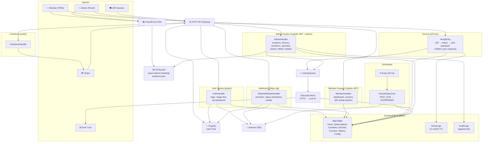

# AWS Serverless Architecture Design

> Derived from: [`docs/technical-spec.md`](file:///C:/Users/golebiowskib/OneDrive%20-%20TRANSITION%20TECHNOLOGIES%20PSC%20S.A/Desktop/coding/crossbox-gym/docs/technical-spec.md)
> Status: final

## 1. Overview & Constraints

- **Source document:** [Technical Specification: Automated Gym Platform (MVP)](file:///C:/Users/golebiowskib/OneDrive%20-%20TRANSITION%20TECHNOLOGIES%20PSC%20S.A/Desktop/coding/crossbox-gym/docs/technical-spec.md)
- **Scope:** MVP — single-tenant deployment, one gym owner, one or more locations (all 24/7), 2 roles (Member + Admin), 36 functional requirements.
- **AWS-only, serverless-only:** no EC2, ECS/EKS, self-managed servers, or non-AWS services.
- **Design principle:** Minimize AWS resource count. Consolidate where possible. Lean on Stripe's built-in retry mechanism instead of building internal resilience infrastructure.
- **Fixed technology constraints from source:**
  - **Stripe** — all payment processing, billing, subscriptions, hosted checkout, customer portal.
  - **AWS Cognito** — identity management (email + password auth). Magic Links are a custom implementation (DynamoDB token + Lambda).
  - **HMAC-SHA256** — QR code signing.
  - **Direct HTTP** — lock relay communication (Lambda → lock IP address).

---

## 2. Compute — AWS Lambda

| Function | Trigger | Responsibility | Source (FR-n / flow) | Notes |
|---|---|---|---|---|
| `AuthHandler` | API GW: `POST /auth/*` | Routes internally: `/auth/login` (Cognito SRP auth), `/auth/magic-link` (generate token + return link URL, rate-limit 3/hr), `/auth/magic-link/verify` (validate token, AdminInitiateAuth), `/auth/set-password` (first login) | FR-04, FR-05, FR-06, FR-07, FR-16 | Public routes (no Cognito auth) except set-password |
| `MemberHandler` | API GW: `GET/POST /member/*` | Routes internally: `/member/dashboard` (return status + subscription + locations), `/member/consent` (write consent record), `/member/qr` (validate status, generate HMAC-signed QR), `/member/portal-session` (create Stripe Portal session with return_url) | FR-17, FR-18, FR-19, FR-20, FR-21, FR-26 | Cognito JWT required |
| `CheckoutHandler` | API GW: `POST /checkout/session` | Create Stripe Checkout session with location metadata, return redirect URL | FR-01, FR-02 | Public (no auth) |
| `StripeWebhookHandler` | API GW: `POST /webhook/stripe` | Validate Stripe signature, switch on event type via modular event handlers (`events/`): `checkout.session.completed` → create Cognito user + User item + Subscription item. `customer.subscription.updated` / `deleted` → update status + grace_period. `invoice.paid` → record invoice history. `invoice.payment_failed` → log warning. | FR-03, FR-09, FR-11, FR-12, FR-14 | No auth (Stripe signature). Idempotent — Stripe retries on failure (3 days). |
| `VerifyEntry` | API GW: `POST /device/verify` | Full verification chain: lookup device by API key → validate QR (HMAC + TTL ≤ 20s) → check subscription status → check anti-passback (15 min). On success: publish to UnlockQueue, write EntryLog, set cooldown. Return sync {result, reason, feedback}. | FR-22, FR-25, Flow 2 | API key checked in Lambda. Must complete <500ms. |
| `ExecuteUnlock` | SQS: `UnlockQueue` | Read device connection_params from DynamoDB, send HTTP POST to lock IP to release relay for 5 seconds | FR-22 (step 4), FR-34 | Async. Retries 3x. |
| `AdminHandler` | API GW: `GET/POST/PUT/DELETE /admin/*` | Router for all admin CRUD: locations (CRUD + write locations.json to S3 on change), devices (CRUD + auto-generate API key), member search (email query), member detail, status overrides (suspend/extend grace + AuditLog), remote unlock (publish to UnlockQueue + AuditLog), HMAC key rotation. | FR-29, FR-30, FR-31, FR-32, FR-33, FR-34, FR-36 | Cognito JWT + admin group check |
| `GraceExpiryCron` | CloudWatch Events: every 30 min | Scan Main table for items with `type=SUBSCRIPTION, status=PAST_DUE, grace_period_end < NOW()`. Transition each to SUSPENDED (conditional update). | FR-10, BR-01 | Safety net for grace period |

**Total: 8 Lambda functions**

---

## 3. Data Layer — DynamoDB

### Table: `MainTable` (single-table design)

- **Source entities:** User, Subscription, Location, Device, ConsentRecord, MagicLinkToken, MagicLinkRateLimit, Config
- **Partition key:** `PK` (String)
- **Sort key:** `SK` (String)
- **Capacity mode:** On-demand
- **TTL attribute:** `ttl` (Number, epoch seconds) — used by MagicLinkTokens (24h) and RateLimit (1h)

#### Item Types & Key Patterns

| Item type | PK | SK | Key attributes | TTL | Source |
|---|---|---|---|---|---|
| **User** | `USER#<user_id>` | `PROFILE` | email, cognito_sub, role, terms_accepted_at, terms_version, terms_ip, password_set, created_at | — | User entity |
| **Subscription** | `USER#<user_id>` | `SUB#<subscription_id>` | stripe_subscription_id, stripe_customer_id, status, grace_period_end, current_period_end, created_at, updated_at | — | Subscription entity |
| **Location** | `LOC#<location_id>` | `METADATA` | name, address, created_at | — | Location entity |
| **Device** | `LOC#<location_id>` | `DEV#<device_id>` | name, type (lock/scanner), connection_params, api_key_hash, status, created_at | — | Device entity |
| **ConsentRecord** | `USER#<user_id>` | `CONSENT#<timestamp>` | terms_version, ip_address | — | ConsentRecord entity |
| **MagicLinkToken** | `TOKEN#<token_hash>` | `TOKEN` | user_id, created_at | 24h | FR-04, FR-07 |
| **MagicLinkRateLimit** | `RATELIMIT#<email>` | `RATELIMIT` | request_count, window_start | 1h | BR-08 |
| **Config** | `CONFIG#<key_name>` | `CONFIG` | value (JSON) | — | FR-36 |

**Stored configs:**
- `CONFIG#HMAC_CURRENT_KEY` — current HMAC signing key
- `CONFIG#HMAC_PREVIOUS_KEY` — previous key (valid 20s during rotation)

#### Access Patterns

| # | Access pattern | Key/Index used | Source |
|---|---|---|---|
| 1 | Get user by user_id | Base: `PK=USER#<id>, SK=PROFILE` | FR-17, FR-22 |
| 2 | Get subscription(s) for user | Base: `PK=USER#<id>, SK begins_with SUB#` | FR-17, FR-21, FR-22 |
| 3 | Get consent for user | Base: `PK=USER#<id>, SK begins_with CONSENT#` | FR-19 |
| 4 | Find user by email | GSI: `EmailIndex` | FR-03, FR-07, FR-15, FR-31 |
| 5 | Map Cognito sub to user | GSI: `CognitoSubIndex` | FR-17 (JWT → user) |
| 6 | Find subscription by stripe_subscription_id | GSI: `StripeSubIndex` | FR-09, FR-11, FR-12, FR-14 |
| 7 | List all locations | GSI: `GSI1` with `GSI1PK=LOCATIONS` | FR-01, FR-29 |
| 8 | List devices by location | Base: `PK=LOC#<id>, SK begins_with DEV#` | FR-30 |
| 9 | Authenticate device by API key | GSI: `ApiKeyIndex` | FR-22, FR-30 |
| 10 | Get device by device_id | GSI: `DeviceIdIndex` | FR-34 |
| 11 | Validate magic link token | Base: `PK=TOKEN#<hash>, SK=TOKEN` | FR-04, FR-07 |
| 12 | Check/increment rate limit | Base: `PK=RATELIMIT#<email>` (conditional update) | BR-08 |
| 13 | Get HMAC key(s) | Base: `PK=CONFIG#HMAC_CURRENT_KEY` | FR-21, FR-22, FR-36 |
| 14 | Scan PAST_DUE subscriptions past grace | GSI: `StatusIndex` with filter | FR-10 |

#### Global Secondary Indexes

| GSI name | PK | SK | Projected | Purpose | Source |
|---|---|---|---|---|---|
| `EmailIndex` | `email` | — | ALL | User lookup by email | FR-03, FR-07, FR-31 |
| `CognitoSubIndex` | `cognito_sub` | — | KEYS_ONLY | JWT sub → user_id | FR-17 |
| `StripeSubIndex` | `stripe_subscription_id` | — | ALL | Webhook → subscription | FR-09, FR-11, FR-12, FR-14 |
| `ApiKeyIndex` | `api_key_hash` | — | ALL | Device auth by API key | FR-22 |
| `DeviceIdIndex` | `device_id` | — | ALL | Direct device lookup | FR-34 |
| `GSI1` | `GSI1PK` | `GSI1SK` | ALL | Overloaded: locations list (`GSI1PK=LOCATIONS`), status queries (`GSI1PK=STATUS#PAST_DUE`) | FR-01, FR-10, FR-29 |

> **Note on GSI1:** Location items set `GSI1PK=LOCATIONS, GSI1SK=LOC#<id>`. Subscription items set `GSI1PK=STATUS#<status>, GSI1SK=<grace_period_end>`. This allows listing all locations AND querying PAST_DUE subscriptions with grace period filter using a single GSI.

---

### Table: `EntryLogs`

- **Source entity:** EntryLog
- **Partition key:** `PK` = `USER#<user_id>`
- **Sort key:** `SK` = `ENTRY#<timestamp>#<entry_id>`
- **Capacity mode:** On-demand
- **TTL attribute:** `ttl` (set to timestamp + 12 months)

Separate table because: different retention policy (12-month auto-purge), high write volume, no relationship to other entities.

**Item attributes:** entry_id, user_id, location_id, timestamp, result (success/denied), denial_reason, device_id, ttl

| # | Access pattern | Key/Index used | Source |
|---|---|---|---|
| 1 | Recent entries for user (admin view) | Base: `PK=USER#<id>, SK begins_with ENTRY#`, reverse, Limit 30 | FR-32 |
| 2 | Anti-passback check (last entry at location) | GSI: `AntiPassbackIndex` | FR-22, FR-25 |

| GSI name | PK | SK | Purpose | Source |
|---|---|---|---|---|
| `AntiPassbackIndex` | `USER#<user_id>#LOC#<location_id>` | `timestamp` | Query last entry for user+location, check if within 15 min | FR-22, FR-25 |

---

### Table: `AuditLogs`

- **Source entity:** AuditLog
- **Partition key:** `PK` = `AUDIT#<admin_id>`
- **Sort key:** `SK` = `<timestamp>#<audit_id>`
- **Capacity mode:** On-demand
- **TTL attribute:** none (indefinite retention)

Separate table because: append-only, never updated, different access pattern, may need separate backup/compliance treatment.

**Item attributes:** audit_id, admin_id, action_type (remote_unlock / suspend_account / extend_grace), target_entity, target_id, reason, ip_address, timestamp

| # | Access pattern | Key/Index used | Source |
|---|---|---|---|
| 1 | List audit entries by admin | Base: `PK=AUDIT#<admin_id>` | FR-33, FR-34 |

---

## 4. API Layer — API Gateway

### Single HTTP API Gateway

One HTTP API with route groups, different auth per group:

| Route | Method | Auth | Backing Lambda | Source (FR-n) | Notes |
|---|---|---|---|---|---|
| `/checkout/session` | POST | None (public) | `CheckoutHandler` | FR-01, FR-02 | Returns Stripe Checkout URL |
| `/auth/login` | POST | None | `AuthHandler` | FR-16 | Returns Cognito JWT |
| `/auth/magic-link` | POST | None | `AuthHandler` | FR-07 | Rate-limited 3/hr |
| `/auth/magic-link/verify` | GET | None | `AuthHandler` | FR-04, FR-05 | Token in query param |
| `/auth/set-password` | POST | Cognito JWT | `AuthHandler` | FR-06 | First-login only |
| `/member/dashboard` | GET | Cognito JWT | `MemberHandler` | FR-17, FR-18 | |
| `/member/consent` | POST | Cognito JWT | `MemberHandler` | FR-19, FR-20 | |
| `/member/qr` | POST | Cognito JWT | `MemberHandler` | FR-21 | Returns signed QR payload |
| `/member/portal-session` | POST | Cognito JWT | `MemberHandler` | FR-26 | Returns Stripe Portal URL |
| `/device/verify` | POST | None (API key checked in Lambda) | `VerifyEntry` | FR-22, Flow 2 | ≤500ms. Lambda validates API key from header. |
| `/webhook/stripe` | POST | None (Stripe signature in Lambda) | `StripeWebhookHandler` | FR-03, FR-09, FR-11, FR-12, FR-14 | |
| `/admin/locations` | GET | Cognito JWT (admin) | `AdminHandler` | FR-29 | |
| `/admin/locations` | POST | Cognito JWT (admin) | `AdminHandler` | FR-29 | |
| `/admin/locations/{id}` | PUT | Cognito JWT (admin) | `AdminHandler` | FR-29 | |
| `/admin/locations/{id}` | DELETE | Cognito JWT (admin) | `AdminHandler` | FR-29 | |
| `/admin/locations/{id}/devices` | GET | Cognito JWT (admin) | `AdminHandler` | FR-30 | |
| `/admin/locations/{id}/devices` | POST | Cognito JWT (admin) | `AdminHandler` | FR-30 | Auto-generates API key |
| `/admin/devices/{id}` | PUT | Cognito JWT (admin) | `AdminHandler` | FR-30 | |
| `/admin/devices/{id}` | DELETE | Cognito JWT (admin) | `AdminHandler` | FR-30 | |
| `/admin/members` | GET | Cognito JWT (admin) | `AdminHandler` | FR-31 | `?email=` query |
| `/admin/members/{id}` | GET | Cognito JWT (admin) | `AdminHandler` | FR-32 | |
| `/admin/members/{id}/override` | POST | Cognito JWT (admin) | `AdminHandler` | FR-33 | +AuditLog |
| `/admin/devices/{id}/unlock` | POST | Cognito JWT (admin) | `AdminHandler` | FR-34 | +AuditLog, publishes to UnlockQueue |
| `/admin/hmac/rotate` | POST | Cognito JWT (admin) | `AdminHandler` | FR-36 | |

**Auth configuration:**
- **Cognito JWT authorizer** attached to `/member/*`, `/admin/*`, and `/auth/set-password` routes.
- `/admin/*` routes: Lambda checks `cognito:groups` claim contains `admins` (authorization logic in `AdminHandler`).
- `/device/*` and `/webhook/*`: no API Gateway authorizer — auth validated inside Lambda (API key / Stripe signature).
- All other routes: public (no auth).

---

## 5. Orchestration — Step Functions

**None.** Account provisioning (FR-03) is handled by a single idempotent `StripeWebhookHandler` Lambda. Each provisioning step (create Cognito user, create User item, create Subscription, send email) checks if already completed before executing. Stripe's built-in webhook retry (up to 3 days) handles transient failures without needing a state machine.

---

## 6. Messaging — SQS

| Resource | Type | Producers | Consumers | Error handling | Source |
|---|---|---|---|---|---|
| `UnlockQueue` | SQS (standard) | `VerifyEntry` Lambda, `AdminHandler` Lambda (remote unlock) | `ExecuteUnlock` Lambda | 3 retries, then discarded (no DLQ for MVP — failures logged to CloudWatch) | FR-22, FR-34 |

**No EventBridge.** Stripe webhook fan-out is handled by internal routing in `StripeWebhookHandler` Lambda. Stripe's own retry mechanism provides resilience.

---

## 7. IAM — Least-Privilege Intent

| Component | Can access | Access level | Source | Notes |
|---|---|---|---|---|
| `AuthHandler` | Cognito User Pool | AdminInitiateAuth, AdminSetUserPassword, AdminCreateUser | FR-04, FR-06, FR-07 | |
| `AuthHandler` | DynamoDB `MainTable` | GetItem, PutItem, UpdateItem, DeleteItem (tokens + rate limit + users) | FR-04, FR-07, BR-08 | Scoped to TOKEN#, RATELIMIT#, USER# prefixes |
| `MemberHandler` | DynamoDB `MainTable` | GetItem, Query, PutItem (user, subscription, consent, config, locations) | FR-17, FR-19, FR-21 | Read-heavy except consent write |
| `CheckoutHandler` | Stripe API | External HTTPS | FR-02 | Stripe secret in env var |
| `StripeWebhookHandler` | Cognito User Pool | AdminCreateUser | FR-03 | Account provisioning |
| `StripeWebhookHandler` | DynamoDB `MainTable` | PutItem, UpdateItem, GetItem (users, subscriptions) | FR-03, FR-09, FR-11, FR-12, FR-14 | Conditional updates for state transitions |
| `VerifyEntry` | DynamoDB `MainTable` | GetItem, Query (devices, subscriptions, config) | FR-22 | Read HMAC key, check status |
| `VerifyEntry` | DynamoDB `EntryLogs` | PutItem, Query (anti-passback check + log entry) | FR-22, FR-25 | |
| `VerifyEntry` | SQS `UnlockQueue` | SendMessage | FR-22 | On successful verification |
| `ExecuteUnlock` | DynamoDB `MainTable` | GetItem (device connection_params) | FR-22 | Read lock IP/URL |
| `AdminHandler` | DynamoDB `MainTable` | GetItem, PutItem, UpdateItem, DeleteItem, Query, Scan | FR-29–FR-36 | Full CRUD on locations, devices, members |
| `AdminHandler` | DynamoDB `AuditLogs` | PutItem | FR-33, FR-34 | Write audit entries |
| `AdminHandler` | SQS `UnlockQueue` | SendMessage | FR-34 | Remote unlock |
| `GraceExpiryCron` | DynamoDB `MainTable` | Query (GSI1: STATUS#PAST_DUE), UpdateItem (conditional) | FR-10 | Transition PAST_DUE → SUSPENDED |

---

## 8. Business Rule Enforcement

| Business rule | Enforcement mechanism | Where |
|---|---|---|
| **BR-01: State Machine** | DynamoDB conditional updates: `ConditionExpression` validates current status before transition (e.g., `status = :past_due` before setting SUSPENDED) | `StripeWebhookHandler`, `AdminHandler`, `GraceExpiryCron` |
| **BR-02: Access Rules** | Lambda logic: check `status ∈ {ACTIVE, PAST_DUE (grace_period_end > NOW()), CANCELED (current_period_end > NOW())}` | `VerifyEntry`, `MemberHandler` (QR generation) |
| **BR-03: Anti-Passback** | DynamoDB query on `AntiPassbackIndex` (EntryLogs GSI): check if successful entry exists for user+location within last 15 min | `VerifyEntry` |
| **BR-04: QR Validity** | Lambda logic: HMAC-SHA256 signature verification against current key (+ previous key during rotation), TTL check (`timestamp + 20s > NOW()`) | `VerifyEntry` |
| **BR-05: Grace Period** | `grace_period_end` stored on Subscription item. `GraceExpiryCron` (every 30 min) transitions stale PAST_DUE. Extension: `AdminHandler` conditional update (max 168h). | `StripeWebhookHandler`, `GraceExpiryCron`, `AdminHandler` |
| **BR-06: Membership Scope** | No location filter in `VerifyEntry` — any valid subscription allows entry at any location | `VerifyEntry` |
| **BR-07: Billing Cycle** | Delegated to Stripe (calendar monthly, anchored to start date) | External (Stripe) |
| **BR-08: Rate Limits** | DynamoDB conditional update on `RATELIMIT#<email>` item: `count < 3`, with 1h TTL auto-cleanup | `AuthHandler` |
| **BR-09: Lock Relay** | `ExecuteUnlock` sends HTTP command with 5-second duration param | `ExecuteUnlock` |
| **BR-10: Consent** | `MemberHandler` (QR generation) checks if `CONSENT#` item exists for user before generating QR | `MemberHandler` |

---

## 9. Observability (non-blocking)

- **CloudWatch Logs:** Default per Lambda — all 8 functions log to `/aws/lambda/<function-name>`.
- **Key metrics to watch:**
  - `VerifyEntry` duration p99 (target: <500ms)
  - `ExecuteUnlock` Lambda errors (failed unlock commands — logged to CloudWatch)
  - `GraceExpiryCron` errors
  - `StripeWebhookHandler` errors (indicates provisioning or status transition failures)
- **Alarms:** None for MVP. Admin monitors via CloudWatch console.

---

## 10. Static Assets & Storage

| Resource | Type | Purpose | Source |
|---|---|---|---|
| `StaticAssetsBucket` | S3 | All static assets: `/pwa/*` (PWA), `/admin/*` (Admin Panel), `/landing/*` (Landing page) | FR-01, FR-16, FR-17 |
| `CDNDistribution` | CloudFront | Single CDN for all static content. Cache behaviors route `/pwa/*`, `/admin/*`, `/landing/*` to the S3 bucket. API requests proxied to API Gateway origin. | All frontend FRs |

**CloudFront behaviors:**
- Default behavior → S3 origin (static assets)
- `/api/*` behavior → API Gateway origin (if using custom domain; otherwise API GW has its own URL)

---

## 11. Identity — Cognito

| Resource | Configuration | Source |
|---|---|---|
| **User Pool** | Email as username. Standard password policy (8+ chars, mixed case, numbers). No MFA. Custom attribute: `custom:role` (member/admin). User group: `admins`. | FR-06, FR-35 |
| **Auth flow** | USER_PASSWORD_AUTH (SRP). Access token TTL: 1 hour. Refresh token TTL: 30 days (maps to FR-27 session policy). | FR-16, FR-27 |
| **Admin authorization** | `admins` group in Cognito. `AdminHandler` Lambda checks `cognito:groups` claim in JWT. | FR-35 |
| **Magic Links** | Custom implementation: `AuthHandler` generates signed token → stored in MainTable (`TOKEN#` item, 24h TTL) → `AuthHandler` verify route validates and calls `AdminInitiateAuth` to create session. | FR-04, FR-07 |

---

## 12. Architecture Diagram



---

## 13. Resource Summary

| AWS Service | Count | Resources |
|---|---|---|
| **API Gateway** | 1 | HTTP API with 24 routes |
| **Lambda** | 8 | AuthHandler, MemberHandler, CheckoutHandler, StripeWebhookHandler, VerifyEntry, ExecuteUnlock, AdminHandler, GraceExpiryCron |
| **DynamoDB** | 3 tables, 6 GSIs | MainTable (6 GSIs), EntryLogs (1 GSI), AuditLogs (0 GSIs) |
| **SQS** | 1 | UnlockQueue |
| **Cognito** | 1 | User Pool (email+password, admins group) |
| **S3** | 1 | StaticAssetsBucket (PWA + Admin + Landing + locations.json) |
| **CloudFront** | 1 | CDN for all static content |
| **SES** | 1 | Email delivery (5 notification types) |
| **CloudWatch Events** | 1 | Cron rule (every 30 min) |
| **Step Functions** | 0 | — |
| **EventBridge** | 0 | — |
| **Total AWS resources** | **~17** | |

---

## 14. Open Questions

| # | Question | Impact |
|---|---|---|
| 1 | **Lock and scanner model selection:** Which specific lock relay and QR scanner will be used? Determines the HTTP endpoint format for `ExecuteUnlock` and the scanner's request format for `VerifyEntry`. | Carried from tech spec. Must be decided before implementation. |

---

## 15. Resolved Architecture Ambiguities

| # | Question | Answer | Impact |
|---|---|---|---|
| 1 | API Gateway topology? | Single HTTP API Gateway with route groups. Cognito JWT on member/admin routes, API key checked in Lambda for devices, Stripe signature in Lambda for webhooks. | 1 API GW instead of 4. |
| 2 | Cognito auth for Magic Links? | Standard email+password (SRP). Magic Links are custom: DynamoDB token (24h TTL) + Lambda + AdminInitiateAuth. Federated login deferred to v2. | No custom Cognito challenge flows. |
| 3 | DynamoDB strategy? | 3 tables: MainTable (single-table for 8 item types), EntryLogs (TTL/purge), AuditLogs (append-only). 6 GSIs on MainTable. | 3 tables instead of 11. |
| 4 | Entry verification model? | Sync `VerifyEntry` Lambda (full chain, <500ms response) + async `ExecuteUnlock` via SQS. | Decoupled hardware from verification latency. |
| 5 | Lock communication? | Direct HTTP from Lambda to lock's public IP (Shelly-style). | No IoT Core. |
| 6 | Stripe webhook processing? | Single `StripeWebhookHandler` Lambda with internal switch/case. No EventBridge. Stripe retries on failure (3 days). | 0 EventBridge resources. |
| 7 | Grace period scheduling? | CloudWatch cron every 30 min scans for stale PAST_DUE subscriptions. No DynamoDB Streams, no TTL-trigger, no Step Functions Wait. | 1 cron rule, no Streams. |
| 8 | Email service? | Amazon SES — direct API calls from Lambda. | Cheapest, full control. |
| 9 | Frontend hosting? | 1 S3 bucket (path prefixes) + 1 CloudFront distribution. | 1 bucket + 1 CDN instead of 3+3. |
| 10 | HMAC key storage? | DynamoDB MainTable (`CONFIG#` items). | No Secrets Manager. |
| 11 | Account provisioning? | Single idempotent Lambda (each step checks before executing). Stripe retries handle failures. No Step Functions. | 0 state machines. |
| 12 | Location data for landing page? | `AdminHandler` writes `locations.json` to S3 inline on location CRUD. No DynamoDB Streams. | No Streams infrastructure. |
| 13 | Webhook endpoint placement? | Route on the same HTTP API Gateway (`/webhook/stripe`), no auth. Signature validated in Lambda. | Part of single API GW. |
| 14 | Scanner interaction? | Sync response from `VerifyEntry` with {result, reason, feedback}. Unlock published to SQS independently. | Scanner doesn't wait for lock. |
| 15 | DLQ strategy? | No DLQ for MVP. UnlockQueue retries 3x then discards. Failures logged to CloudWatch. User re-scans QR to retry. | Minimal failure infrastructure. |

---

## 16. Provider Adapter Pattern & Code Organization

### 16.1 Provider Adapter Abstraction (Dependency Injection)

To ensure fast, deterministic, 100% automated integration testing (`deploy → test → destroy`) without physical hardware or external third-party network dependencies (Stripe API), external integrations use an **Adapter Pattern + Factory**:

```
                          ┌──────────────────────┐
                          │   Lambda Function    │
                          └──────────┬───────────┘
                                     │ (Factory Pattern)
                          ┌──────────┴───────────┐
                          ▼                      ▼
                   PaymentProvider          LockProvider
                ├── StripePaymentProvider    ├── HttpLockProvider
                └── MockPaymentProvider     └── MockLockProvider
```

1. **`PaymentProvider`** (`lib/handlers/shared/providers/payment/`):
   - `StripePaymentProvider`: Calls live/test Stripe API (`sk_test_...` or `sk_live_...`). Managed via `stripe-client-manager.ts`.
   - `MockPaymentProvider`: Generates dummy checkout URLs and processes mock webhook payloads locally without external HTTP calls.
2. **`LockProvider`** (`lib/handlers/shared/providers/lock.ts`):
   - `HttpLockProvider`: Sends HTTP POST to real lock IP address.
   - `MockLockProvider`: Logs unlock payloads and records entry assertions for test validation.

**Environment Variable Control (`lib/handlers/shared/env.ts`):**
- Centralized `shared/env.ts` module with fail-fast validation (`requireEnv()`), scope-specific getters, and explicit defaults.
- `PAYMENT_PROVIDER` = `stripe` | `mock`
- `LOCK_PROVIDER` = `http` | `mock`

### 16.2 Stripe Webhook Event Handler Modularization

The `StripeWebhookHandler` (`lib/handlers/stripe-webhook/`) uses a thin dispatcher pattern (`index.ts`) that delegates event handling to dedicated modules under `events/`:
- `checkout-session-completed.ts`: Handles `checkout.session.completed` (Cognito user creation + DynamoDB profile & subscription creation).
- `subscription-updated.ts`: Handles `customer.subscription.updated` and `deleted`.
- `invoice-paid.ts`: Handles `invoice.paid` history recording.
- `invoice-payment-failed.ts`: Handles `invoice.payment_failed` logging.
- `context.ts`: Encapsulates shared invocation context (`WebhookContext`).

---

### 16.2 Automated CDK Testing & Clean Teardown Lifecycle

To enable single-command integration testing (`npm run test:e2e`), the CDK stack enforces:

1. **CDK Parameter `isTestEnvironment=true`**:
   - Sets `RemovalPolicy.DESTROY` on all DynamoDB tables, S3 buckets, and Cognito User Pools.
   - Sets `autoDeleteObjects: true` on `StaticAssetsBucket` (ensuring non-empty bucket teardown succeeds during `cdk destroy`).
   - Configures `PAYMENT_PROVIDER=mock`, `LOCK_PROVIDER=mock` on all Lambda functions.

2. **Required CloudFormation Stack Outputs (`CfnOutput`)**:
   - `ApiUrl`: API Gateway root endpoint URL.
   - `UserPoolId`: Cognito User Pool ID.
   - `UserPoolClientId`: Cognito User Pool Client ID.
   - `MainTableName`: DynamoDB MainTable name.
   - `EntryLogsTableName`: DynamoDB EntryLogs table name.
   - `UnlockQueueUrl`: SQS Queue URL for asserting background jobs.

3. **Single CLI Test Runner Script (`npm run test:e2e`)**:
   ```bash
   # 1. Deploy test stack and export outputs
   npx cdk deploy GymTestStack --outputs-file test-outputs.json
   
   # 2. Run automated integration test suite against deployed stack
   npm run test:integration -- --outputs=test-outputs.json
   
   # 3. Cleanly destroy all stack resources
   npx cdk destroy GymTestStack --force
   ```

---

### 16.3 Production Operational Tuning

1. **Zero-Cold-Start Tuning for Door Unlock (`<500ms` SLA)**:
   - `VerifyEntry` Lambda memory allocated to **1024 MB** (provides full single-vCPU performance).
   - Code bundled via `esbuild` with zero large SDK imports to guarantee warm executions `<50ms` and cold starts `<300ms`.

2. **CORS Configuration**:
   - Development / Testing mode: API Gateway CORS permits `http://localhost:5173` and `http://localhost:3000`.
   - Production mode: API Gateway CORS strictly restricted to CloudFront distribution domain (`CDNDistribution`).

3. **Secrets Management**:
   - Live Stripe keys (`STRIPE_SECRET_KEY`, `STRIPE_WEBHOOK_SECRET`) stored in **AWS SSM Parameter Store** (`/crossbox/stripe/secret-key`, `/crossbox/stripe/webhook-secret`).
   - Non-prod / Mock mode uses dummy key strings inline.

4. **Seed Admin Provisioning**:
   - Deployment includes an automated seed script (`npm run seed`) or CDK Custom Resource that creates the initial Admin user in Cognito and assigns them to the `admins` user group.

