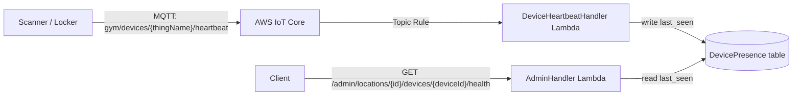

# Implementation Plan: Real Device Healthcheck

> **Repository:** `crossbox-gym` (AWS/CDK backend)  
> **Scope:** Replace the stub `checkDeviceHealth` with a heartbeat-based presence check that reports whether the physical scanner or locker is actually connected to AWS IoT Core.

---

## 1. Goal & Decisions

- **Healthcheck will detect when a device is offline.**
- **Mechanism:** device heartbeat + DynamoDB presence table.
- **Device-side identity:** the healthcheck `deviceId` is the IoT Thing Name (e.g. `crossbox-qr-scanner-01`).
- **Offline threshold:** 30 seconds.
- **Device heartbeat interval:** 10–15 seconds (must be ≤ half the threshold).
- **Unified topic for both scanners and lockers:** `gym/devices/{thingName}/heartbeat`.
- **Why not just check Lambda-to-IoT-Core?** The Lambda can reach IoT Core even when the physical device is powered off. We need device-side presence.

---

## 2. Architecture



---

## 3. Files to Change

| # | File | Change |
|---|---|---|
| 1 | `lib/handlers/admin/repository.ts` | Add `DevicePresenceRepository` interface + `DynamoDbDevicePresenceRepository` implementation. |
| 2 | `lib/handlers/admin/service.ts` | Rewrite `checkDeviceHealth` to read presence and compute `connected` / `status`. Add presence dependency. |
| 3 | `lib/handlers/admin/index.ts` | Wire presence repository and offline threshold into `AdminService`. |
| 4 | `lib/handlers/admin/environment.ts` | Load `DEVICE_OFFLINE_THRESHOLD_MS` (default 30000). |
| 5 | `lib/handlers/device-heartbeat/index.ts` | New Lambda: parse MQTT topic, extract Thing Name, write `last_seen`. |
| 6 | `lib/stacks/data-stack.ts` | Add `DevicePresence` DynamoDB table (PK `thingName`, TTL `ttl`). |
| 7 | `lib/stacks/api-stack.ts` | Add `DeviceHeartbeatHandler` Lambda + env/permissions; update `AdminHandler` env/permissions. |
| 8 | `lib/stacks/iot-stack.ts` | Add heartbeat topic rule, IoT policy publish permission, Lambda invoke permission. |
| 9 | `lib/config/iot-fleet.json` | Add heartbeat topic template and rule config. |
| 10 | `test/admin-service.test.ts` | Add fake presence repository and online/offline assertions. |
| 11 | `test/device-heartbeat-handler.test.ts` | New tests for heartbeat ingestion. |

---

## 4. Heartbeat Payload Contract

```json
{
  "thingName": "crossbox-qr-scanner-01",
  "deviceType": "HDWR-HD360-QR-Scanner",
  "status": "online",
  "timestamp": "2026-08-05T12:34:56.789Z",
  "uptime_ms": 3600000,
  "version": "1.0.0"
}
```

**Fields:**
- `thingName` — the IoT Thing Name; must match the topic placeholder.
- `deviceType` — matches `deviceType` from `lib/config/iot-fleet.json`.
- `status` — `"online"` or `"offline"`.
- `timestamp` — ISO 8601 UTC.
- `uptime_ms` — optional, milliseconds since device boot.
- `version` — optional firmware version.

The backend uses the **arrival time** (Topic Rule timestamp) as the authoritative `last_seen`. The payload `timestamp` is stored but not used for liveness.

---

## 5. Phase-by-Phase Implementation

### Phase 1 — Presence data model & repository

1. In `lib/stacks/data-stack.ts`, create a new table:

```ts
this.devicePresenceTable = new dynamodb.Table(this, 'DevicePresence', {
  partitionKey: { name: 'thingName', type: dynamodb.AttributeType.STRING },
  billingMode: dynamodb.BillingMode.PAY_PER_REQUEST,
  timeToLiveAttribute: 'ttl',
  removalPolicy,
});
```

2. Expose `devicePresenceTable` from `CrossboxDataStack`.

3. In `lib/handlers/admin/repository.ts`, add:

```ts
export interface DevicePresence {
  thingName: string;
  lastSeen: string; // ISO 8601
}

export interface DevicePresenceRepository {
  getPresence(thingName: string): Promise<DevicePresence | undefined>;
  updatePresence(thingName: string, timestamp: string): Promise<void>;
}

export class DynamoDbDevicePresenceRepository implements DevicePresenceRepository {
  constructor(
    private readonly client: DynamoDBDocumentClient,
    private readonly tableName: string,
    private readonly ttlSeconds: number = 86400,
  ) {}
  // Use GetCommand and PutCommand/UpdateCommand
}
```

### Phase 2 — Rewrite `checkDeviceHealth`

In `lib/handlers/admin/service.ts`:

1. Add `presenceRepository: DevicePresenceRepository` to `AdminServiceDependencies`.
2. Rewrite `checkDeviceHealth`:

```ts
async checkDeviceHealth(adminId: string, deviceId: string, locationId?: string) {
  if (!deviceId?.trim()) throw new ValidationError('device_id is required');
  const thingName = deviceId.trim();
  const start = this.now().getTime();
  const presence = await this.dependencies.presenceRepository.getPresence(thingName);
  const elapsed = this.now().getTime() - start;
  const thresholdMs = this.dependencies.deviceOfflineThresholdMs ?? 30000;
  const connected = !!presence && (this.now().getTime() - new Date(presence.lastSeen).getTime()) < thresholdMs;
  const result = {
    device_id: thingName,
    status: connected ? 'ONLINE' : 'OFFLINE',
    connected,
    latency_ms: elapsed,
    last_seen: presence?.lastSeen ?? null,
    thing_name: thingName,
  };
  await this.audit(adminId, 'device_health_check', { target_id: thingName, location_id: locationId });
  return result;
}
```

### Phase 3 — Heartbeat ingestion Lambda

Create `lib/handlers/device-heartbeat/index.ts`:

```ts
import { DynamoDBDocumentClient } from '@aws-sdk/lib-dynamodb';
import { ddb } from '../shared/database';
import { DynamoDbDevicePresenceRepository } from '../admin/repository';

export const handler = async (event: { topic?: string; thingName?: string }[]) => {
  const repo = new DynamoDbDevicePresenceRepository(
    ddb as DynamoDBDocumentClient,
    process.env.PRESENCE_TABLE_NAME!,
  );
  for (const record of event) {
    const thingName = record.thingName || record.topic?.split('/').slice(-2)[0];
    if (!thingName) continue;
    await repo.updatePresence(thingName, new Date().toISOString());
  }
};
```

> IoT Topic Rule invokes Lambda with an array shaped by the rule SQL. Adjust parsing to match the SQL you configure.

### Phase 4 — Update stacks

#### `lib/stacks/api-stack.ts`

- Add `DeviceHeartbeatHandler` Lambda:
  - entry: `lib/handlers/device-heartbeat/index.ts`
  - env: `PRESENCE_TABLE_NAME: dataStack.devicePresenceTable.tableName`
  - permissions: `dataStack.devicePresenceTable.grantWriteData(...)`
- Update `AdminHandler`:
  - env: `PRESENCE_TABLE_NAME`, `DEVICE_OFFLINE_THRESHOLD_MS: '30000'`
  - permissions: `dataStack.devicePresenceTable.grantReadData(...)`

#### `lib/stacks/iot-stack.ts`

- Add heartbeat topic rule:

```ts
new iot.CfnTopicRule(this, 'DeviceHeartbeatRule', {
  ruleName: 'CrossboxDeviceHeartbeatRule',
  topicRulePayload: {
    sql: "SELECT *, topic(3) as thingName FROM 'gym/devices/+/heartbeat'",
    actions: [{ lambda: { functionArn: apiStack.deviceHeartbeatFunction.functionArn } }],
    ruleDisabled: false,
  },
});
```

- Add `iot:Publish` permission for `gym/devices/*/heartbeat` in the IoT policy.
- Add `lambda.CfnPermission` so IoT can invoke the heartbeat Lambda.

### Phase 5 — Fleet config

In `lib/config/iot-fleet.json`, add per device:

```json
"topics": {
  "scan": "gym/scanners/{thingName}/scan",
  "feedback": "gym/scanners/{thingName}/feedback",
  "heartbeat": "gym/devices/{thingName}/heartbeat"
}
```

And add a top-level rule:

```json
"heartbeatTopicRule": {
  "name": "CrossboxDeviceHeartbeatRule",
  "sql": "SELECT *, topic(3) as thingName FROM 'gym/devices/+/heartbeat'"
}
```

### Phase 6 — Wire the admin handler

In `lib/handlers/admin/index.ts`:

```ts
const service = new AdminService({
  repository,
  auditLogger,
  lockPublisher: ...,
  presenceRepository: new DynamoDbDevicePresenceRepository(ddb, environment.presenceTableName),
  deviceOfflineThresholdMs: parseInt(environment.deviceOfflineThresholdMs, 10),
});
```

### Phase 7 — Tests

1. `test/admin-service.test.ts`:
   - Add `FakeDevicePresenceRepository`.
   - Test fresh heartbeat → `connected: true`, `status: 'ONLINE'`.
   - Test stale heartbeat (e.g. 60 s old with 30 s threshold) → `connected: false`, `status: 'OFFLINE'`.
   - Test no heartbeat → `connected: false`.

2. `test/device-heartbeat-handler.test.ts`:
   - Mock DynamoDB `PutCommand`.
   - Call handler with sample IoT rule event.
   - Assert presence row contains correct `thingName` and `lastSeen`.

---

## 6. Deployment & Verification

1. Run `rtk npm run test:unit` (or `npm test`) and ensure all tests pass.
2. Run `rtk npm run cdk diff` and confirm:
   - `DevicePresence` table is added.
   - `DeviceHeartbeatHandler` Lambda is added.
   - New IoT Topic Rule is added.
   - IoT policy includes heartbeat publish permission.
   - `AdminHandler` has new env vars and read access to presence table.
3. Deploy: `rtk npm run deploy`.
4. In the scanner/locker repos, deploy heartbeat publishing (see their implementation plans).
5. Power off a device and wait 30+ seconds.
6. Call `GET /admin/locations/{locationId}/devices/{deviceId}/health`.
   - Expect `connected: false`, `status: 'OFFLINE'`.
7. Power the device back on, wait for a heartbeat, and call the endpoint again.
   - Expect `connected: true`, `status: 'ONLINE'`.

---

## 7. Notes

- The existing stub `checkDeviceHealth` returned random latency and hardcoded `connected: true`. That entire block is replaced.
- Do **not** use the DynamoDB `mainTable` for high-frequency heartbeat writes; keep presence isolated to avoid hot partitions.
- IoT lifecycle events (`$aws/events/presence/...`) are intentionally out of scope; heartbeat is simpler and does not require enabling fleet indexing.
- If you later need faster detection, lower the threshold and the device heartbeat interval together.
