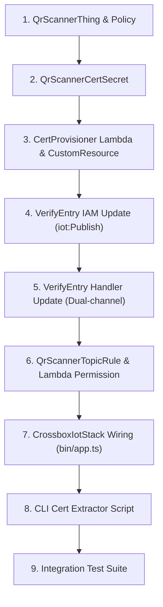

# Implementation Plan: AWS IoT Core Stack for QR Scanner Integration

> **Framework:** AWS CDK (TypeScript)  
> **Target Application:** Crossbox Gym Platform  
> **Purpose:** Provision AWS IoT Core resources for physical Raspberry Pi QR scanner devices over MQTT/mTLS, directly triggering the `VerifyEntry` access flow with sub-500ms latency.

---

## 1. Overview & Architectural Decisions

- **IaC Tool:** AWS CDK (TypeScript v2), integrated into `bin/app.ts` as `CrossboxIotStack` (`lib/stacks/iot-stack.ts`).
- **Communication Protocol:** MQTT over TLS (mTLS X.509 certificates) via AWS IoT Core ATS Data Endpoint.
- **Routing Pattern:** **AWS IoT Topic Rule → Direct `VerifyEntry` Lambda Invocation** for minimal latency (<500ms total entry verification target).
- **Feedback Mechanism:** **Dual-channel response**:
  1. Publishes unlock message to SQS `UnlockQueue` (triggers physical door relay execution).
  2. Publishes MQTT status feedback to `gym/scanners/${scannerId}/feedback` (for screen/audio feedback on RPi scanner).
- **Topics Convention:**
  - **Inbound Scans:** `gym/scanners/+/scan`
  - **Outbound Feedback:** `gym/scanners/${scannerId}/feedback`
- **Certificate Provisioning:** Custom Resource Lambda (Python 3.11 runtime) generates mTLS keys/certs via AWS IoT API and stores them in AWS Secrets Manager (`rpi-qr-scanner/certs`).

---

## 2. Architecture Summary

| # | Resource | Type | Purpose |
|---|---|---|---|
| 1 | `QrScannerThing` | `iot.CfnThing` | Represents physical Raspberry Pi QR scanner device in AWS IoT Registry. |
| 2 | `QrScannerPolicy` | `iot.CfnPolicy` | IoT policy defining allowed MQTT connect, publish (`gym/scanners/*/scan`), subscribe, and receive (`gym/scanners/*/feedback`) permissions. |
| 3 | `QrScannerCertSecret` | `secretsmanager.Secret` | Stores mTLS X.509 Certificate PEM, Private Key, Certificate ID/ARN, and Amazon Root CA 1. |
| 4 | `CertProvisionerLambda` | `lambda.Function` | Python 3.11 inline custom resource handler generating IoT X.509 keys/certs and populating Secrets Manager. |
| 5 | `CertProvisionerProvider` | `cr.Provider` | Custom resource provider wrapping `CertProvisionerLambda`. |
| 6 | `CertProvisionerResource` | `CustomResource` | Executes key creation on CDK deploy, cleanup/revocation on destroy. |
| 7 | `QrScannerTopicRule` | `iot.CfnTopicRule` | SQL Rule (`SELECT *, topic(3) as scannerId FROM 'gym/scanners/+/scan'`) invoking `VerifyEntry` Lambda on scan. |
| 8 | `VerifyEntryIoTInvokerPermission` | `lambda.CfnPermission` | Grants `iot.amazonaws.com` permission to invoke `VerifyEntry` Lambda. |
| 9 | `VerifyEntry` updates | `lambda.Function` | Updated IAM role (`iot:Publish`) & handler logic to handle direct MQTT event payloads and publish feedback. |
| 10 | `FetchCertsCli` | CLI Script | Node/TS utility (`scripts/fetch-iot-certs.ts`) to fetch mTLS certs and ATS endpoint from Secrets Manager for hardware configuration. |

---

## 3. Implementation Order



| Step | Action | Depends On | Rationale |
|---|---|---|---|
| 1 | **Create `iot-stack.ts` Scaffolding** | Existing `api-stack.ts` | Define `CrossboxIotStack` construct receiving `VerifyEntry` Lambda from `apiStack`. |
| 2 | **Provision `CfnThing` & `CfnPolicy`** | Step 1 | Establish device registry identity and least-privilege MQTT policy. |
| 3 | **Create Secrets Manager Secret** | Step 1 | Container for certificate & key payload. |
| 4 | **Add Custom Resource Lambda & Provider** | Step 2, 3 | Automatically generates active X.509 certs and populates Secrets Manager. |
| 5 | **Update `VerifyEntry` Lambda Permissions** | Existing `VerifyEntry` | Grant `iot:Publish` on `gym/scanners/*/feedback` and `iot:DescribeEndpoint`. |
| 6 | **Update `VerifyEntry` Lambda Handler** | Step 5 | Parse both REST API Gateway event (`event.body`) and IoT Core MQTT event (`event.qrCode`, `event.scannerId`), publish MQTT feedback + SQS `UnlockQueue`. |
| 7 | **Create `CfnTopicRule` & Lambda Permission** | Step 4, 6 | Direct IoT SQL query forwarding scan events from `gym/scanners/+/scan` to `VerifyEntry`. |
| 8 | **Wire `CrossboxIotStack` in `bin/app.ts`** | Step 7 | Expose new stack and pass `apiStack.verifyEntryFunction` as dependency. |
| 9 | **Add CLI Certificate Fetch Script** | Step 8 | Developer & deployment script `scripts/fetch-iot-certs.ts`. |
| 10 | **Add Integration Tests** | Step 8 | Verify end-to-end MQTT publish → IoT Rule → `VerifyEntry` execution → SQS + MQTT feedback. |

---

## 4. Resource Implementation Details

### 4.1 Resource: `CrossboxIotStack` (`lib/stacks/iot-stack.ts`)

- **CDK Construct:** `cdk.Stack`
- **Configuration Notes:**
  - Accepts `verifyEntryFunction: lambda.IFunction` from `apiStack`.
  - Context parameters: `thing_name` (default: `rpi-qr-scanner-01`), `policy_name` (default: `rpi-qr-scanner-policy`), `secret_name` (default: `rpi-qr-scanner/certs`).

---

### 4.2 Resource: `QrScannerThing` & `QrScannerPolicy`

- **CDK Construct:** `iot.CfnThing` & `iot.CfnPolicy`
- **Thing Name:** `rpi-qr-scanner-01`
- **Attributes:**
  - `device_type`: `RaspberryPi-QR-Scanner`
  - `version`: `1.0.0`
- **Policy Document:**
  ```json
  {
    "Version": "2012-10-17",
    "Statement": [
      {
        "Effect": "Allow",
        "Action": ["iot:Connect"],
        "Resource": ["arn:aws:iot:${region}:${account}:client/${thing_name}"]
      },
      {
        "Effect": "Allow",
        "Action": ["iot:Publish"],
        "Resource": ["arn:aws:iot:${region}:${account}:topic/gym/scanners/*/scan"]
      },
      {
        "Effect": "Allow",
        "Action": ["iot:Subscribe"],
        "Resource": ["arn:aws:iot:${region}:${account}:topicfilter/gym/scanners/*/feedback"]
      },
      {
        "Effect": "Allow",
        "Action": ["iot:Receive"],
        "Resource": ["arn:aws:iot:${region}:${account}:topic/gym/scanners/*/feedback"]
      }
    ]
  }
  ```

---

### 4.3 Resource: `QrScannerCertSecret` & Custom Resource Provisioner

- **CDK Construct:** `secretsmanager.Secret`, `lambda.Function`, `cr.Provider`, `CustomResource`
- **Secret Name:** `rpi-qr-scanner/certs`
- **Lambda Runtime:** Python 3.11 (inline code `on_event` handler)
- **IAM Policy Actions Needed:**
  - `iot:CreateKeysAndCertificate`, `iot:UpdateCertificate`, `iot:DeleteCertificate`
  - `iot:AttachPolicy`, `iot:DetachPolicy`
  - `iot:AttachThingPrincipal`, `iot:DetachThingPrincipal`
  - `iot:DescribeEndpoint`
  - `secretsmanager:PutSecretValue` on `QrScannerCertSecret`
- **Secret Payload JSON Schema:**
  ```json
  {
    "certificate_pem": "...",
    "private_key": "...",
    "root_ca": "...",
    "certificate_arn": "...",
    "certificate_id": "..."
  }
  ```
- **Error Handling / Cleanup:** On `Delete` event, detaches policy and thing principal, sets cert status to `INACTIVE`, and deletes certificate.

---

### 4.4 Resource: `QrScannerTopicRule`

- **CDK Construct:** `iot.CfnTopicRule`
- **Rule Name:** `QrScannerScanRule`
- **Topic Rule SQL:**
  ```sql
  SELECT *, topic(3) as scannerId FROM 'gym/scanners/+/scan'
  ```
- **Rule Action:**
  - `lambda`: `{ functionArn: verifyEntryFunction.functionArn }`
- **Permission:**
  - `aws_lambda.CfnPermission` or `verifyEntryFunction.addPermission("IoTInvokePermission", { principal: new iam.ServicePrincipal("iot.amazonaws.com"), sourceArn: topicRule.attrArn })`.

---

### 4.5 Resource Updates: `VerifyEntry` Lambda

- **Trigger / Event Source:** Dual-trigger:
  1. API Gateway HTTP POST `/device/verify` (existing)
  2. AWS IoT Core Topic Rule direct invocation (new)
- **Handler Updates (`lib/handlers/verify-entry/index.ts`):**
  - Detect input type:
    - If `event.body` exists → parse REST JSON.
    - If `event.qrCode` / `event.qr_code` exists → extract directly from IoT rule projection.
  - Verification logic: validate HMAC, check subscription, check anti-passback.
  - On Access Granted / Denied:
    1. Send unlock payload to SQS `UnlockQueue` (existing).
    2. Instantiate `@aws-sdk/client-iot-data-plane` (IoT Data ATS Endpoint retrieved via `iot.describeEndpoint` or environment variable `IOT_ENDPOINT`).
    3. Publish MQTT response payload to `gym/scanners/${scannerId}/feedback`:
       ```json
       {
         "result": "GRANTED",
         "reason": "OK",
         "feedback": "Welcome! Door unlocked.",
         "scannerId": "rpi-qr-scanner-01",
         "timestamp": 1722585600
       }
       ```
- **IAM Permissions Needed:**
  - `iot:Publish` on `arn:aws:iot:${region}:${account}:topic/gym/scanners/*/feedback`
  - `iot:DescribeEndpoint`

---

## 5. Cross-Cutting Concerns

- **Secrets & Config Management:**
  - Certificate & Key stored in Secrets Manager `rpi-qr-scanner/certs`.
  - IoT ATS Data Endpoint URL exposed via Stack Output `IotEndpointOutput` and passed to `VerifyEntry` via env var `IOT_ENDPOINT`.
- **Auth (Device Authentication):**
  - X.509 mTLS mutual authentication enforced by AWS IoT Core endpoint.
- **Observability:**
  - CloudWatch Logs for `CertProvisionerHandler`, IoT Topic Rule failure action (logged to CloudWatch Logs / CloudWatch Alarm), and `VerifyEntry` execution logs.
- **Latency Optimization:**
  - Direct Lambda invocation from IoT Topic Rule avoids queue polling latency.
  - IoT Data Plane SDK client cached outside handler in `VerifyEntry` Lambda.

---

## 6. Open Questions & Resolution Log

### Resolved Ambiguities Log

| Question | Answer | Impact |
|---|---|---|
| How should IoT Core route incoming MQTT QR scan messages to the verification flow? | **AWS IoT Topic Rule → Direct Lambda Invocation** | Eliminates queue polling delay; maintains sub-500ms gate response requirement. |
| Which language and CDK structure should be used? | **TypeScript CDK (`lib/stacks/iot-stack.ts`)** | Seamlessly integrates into existing CDK app (`bin/app.ts`), deploys via `npm run deploy`. |
| How should access verification results be returned to hardware? | **Dual-channel (SQS `UnlockQueue` + MQTT feedback topic)** | Triggers physical lock execution via existing queue runner while delivering real-time UI/audio feedback to RPi scanner over MQTT. |
| What MQTT topic convention should be used? | **`gym/scanners/+/scan` (inbound), `gym/scanners/${scannerId}/feedback` (outbound)** | Standardized, extensible topic structure for multi-scanner gym locations. |

---

## 7. Next Steps & Handoff

1. Implement `lib/stacks/iot-stack.ts` in TypeScript CDK.
2. Update `lib/stacks/api-stack.ts` & `lib/handlers/verify-entry/index.ts` to support dual-channel feedback and IoT payloads.
3. Update `bin/app.ts` to instantiate `CrossboxIotStack`.
4. Add `scripts/fetch-iot-certs.ts` for developer & hardware certificate retrieval.
5. Execute `npm run test` and `npm run test:integration` to verify stack synth and integration flows.
